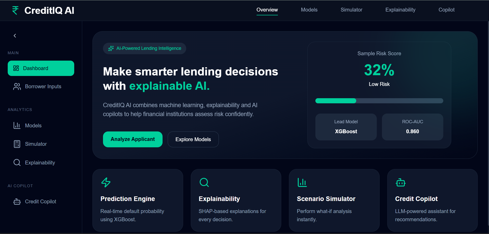
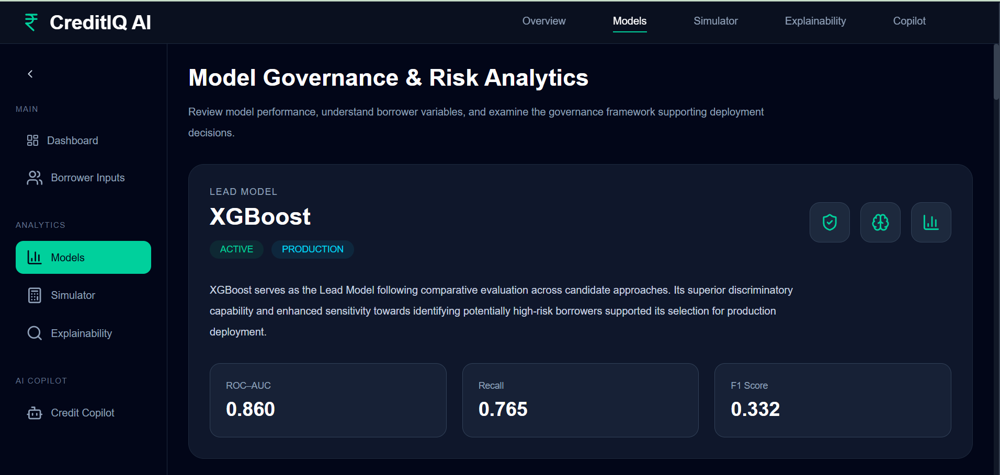
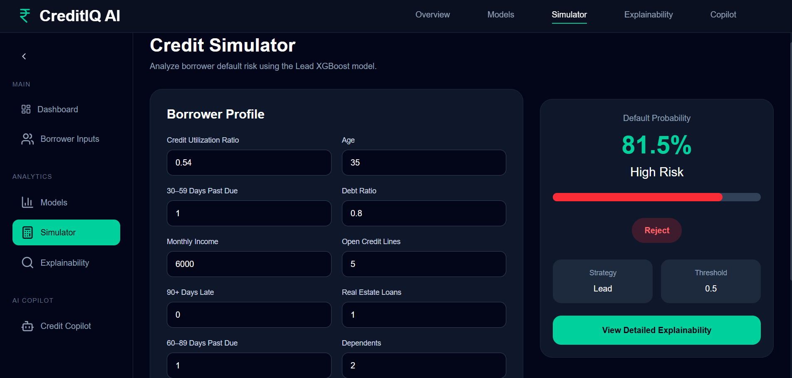
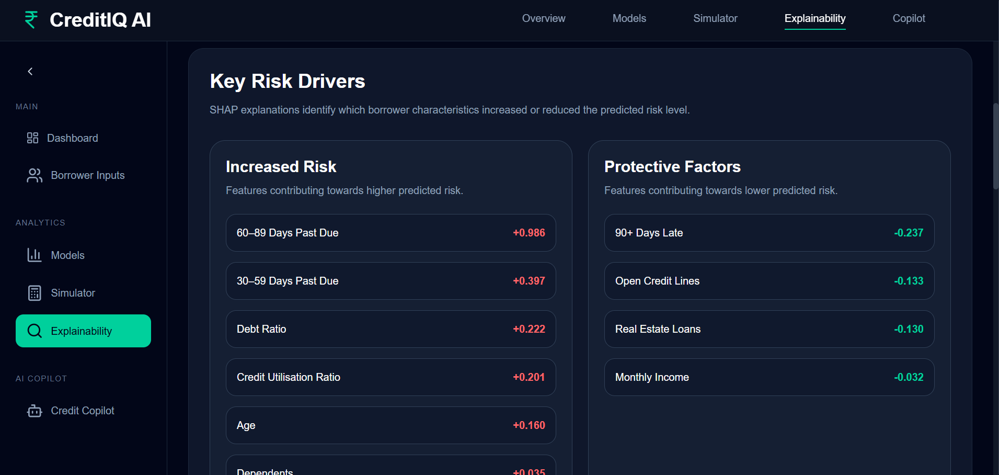
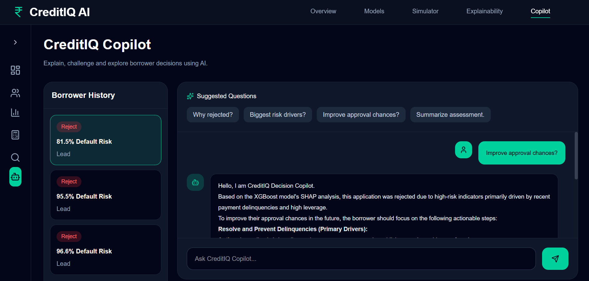
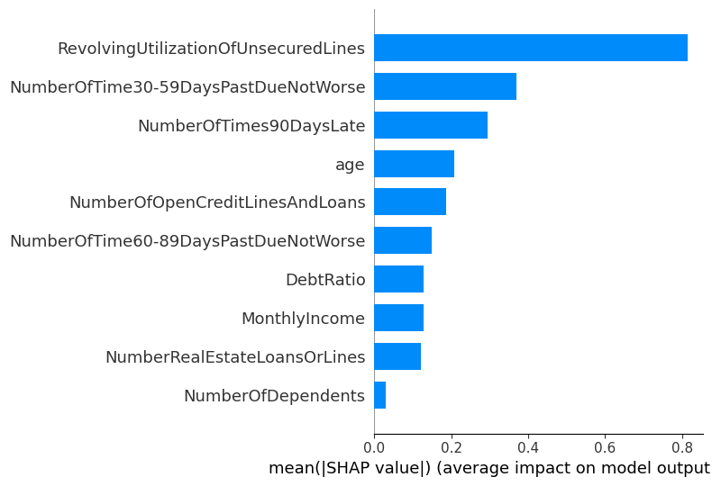
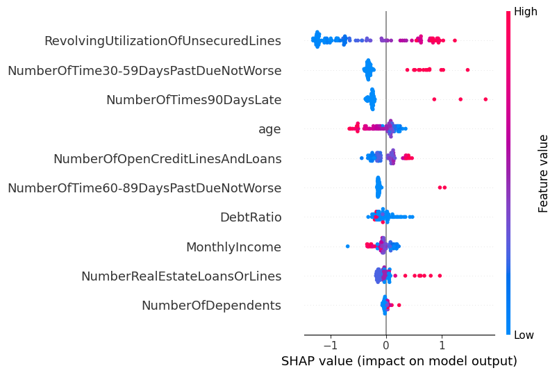
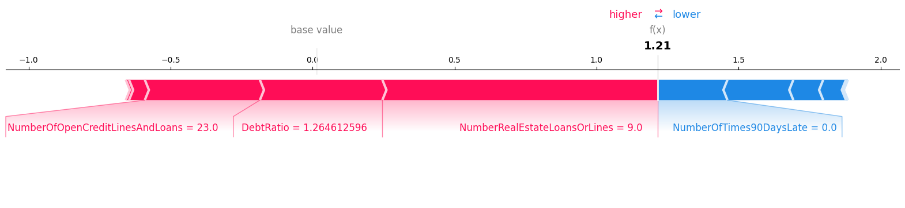

# CreditIQ AI

[](https://credit-iq-ai.vercel.app)
[](https://creditiq-backend-w3cv.onrender.com/docs)


### 🔗 Live Links

🚀 **Live Demo:** https://credit-iq-ai.vercel.app

📘 **API Documentation:** https://creditiq-backend-w3cv.onrender.com/docs

⚙️ **Backend API:** https://creditiq-backend-w3cv.onrender.com


> **An end-to-end explainable credit intelligence platform that combines machine learning, transparent explanations, and AI-assisted decision support to enable more informed lending decisions.**

---

## Executive Summary

Credit risk assessment remains one of the most critical challenges faced by financial institutions. While overly lenient lending decisions can increase default exposure, excessively conservative policies may reject creditworthy applicants and limit growth opportunities.

Traditional scorecards often operate as black boxes, leaving analysts with limited visibility into why a borrower was classified as risky.

**CreditIQ AI** was built to address this challenge by exploring how data science can bridge predictive performance, interpretability, and practical usability.

The platform integrates:

* Rigorous model experimentation,
* Explainable AI techniques,
* Scenario-based borrower simulation,
* Strategy-driven decision thresholds,
* An AI-powered analyst copilot,
* And a fully deployed decision-support application.

---

# Why CreditIQ AI?

Modern lending decisions require answering questions beyond:

> "Will this borrower default?"

Financial institutions increasingly need to understand:

* Why was this decision made?
* Which borrower characteristics influenced the outcome?
* How would the decision change under different scenarios?
* Can analysts interactively explore recommendations?
* How can transparency and trust be incorporated into predictive systems?

CreditIQ AI was designed as a proof-of-concept for a more explainable and analyst-centric approach to credit decisioning.

---

# The Credit Decision Problem

## Objective

Predict the likelihood that a borrower will experience serious delinquency using historical borrower characteristics.

## Dataset

**Give Me Some Credit Dataset**

Source: Kaggle

Problem Type:

* Binary Classification
* Credit Default Prediction

Target Variable:

* SeriousDelinquency (Default vs Non-Default)

---

# Data Challenges

## Class Imbalance

One of the most important characteristics of the dataset was its imbalance.

Most borrowers did **not** default.

This created a situation where traditional evaluation metrics could become misleading.

---

## Missing Values

Missing values were handled using **median imputation**.

Median imputation was selected because financial variables frequently exhibit skewed distributions and outliers.

Using the median helped preserve robustness while minimizing distortion of borrower characteristics.

---

# Why Accuracy Was Misleading

At first glance, the Baseline Logistic Regression appeared to outperform every other model.

However, this conclusion proved deceptive.

A model predicting the majority class can achieve very high accuracy while failing to identify truly risky borrowers.

In lending, failing to detect defaulters may result in substantial financial losses.

Consequently, model evaluation prioritized metrics better aligned with credit risk objectives:

* ROC-AUC
* Recall
* Precision
* F1-score

rather than relying solely on accuracy.

---

## Benchmark Results

| Model                        |  Accuracy | Precision |    Recall |        F1 |   ROC-AUC |
| ---------------------------- | --------: | --------: | --------: | --------: | --------: |
| Baseline Logistic Regression |     0.938 |     0.620 |     0.140 |     0.230 |     0.807 |
| Balanced Logistic Regression |     0.858 |     0.258 |     0.611 |     0.363 |     0.814 |
| SMOTE Logistic Regression    |     0.850 |     0.247 |     0.619 |     0.353 |     0.812 |
| **XGBoost**                  | **0.797** | **0.212** | **0.765** | **0.332** | **0.860** |

---

## Key Insight

Although XGBoost reported the lowest accuracy, it achieved:

* The highest ROC-AUC,
* The strongest default detection capability,
* The highest recall.

This highlighted an important lesson:

> **Maximizing accuracy does not necessarily produce better lending decisions.**

For credit risk modeling, identifying risky borrowers often requires accepting lower overall accuracy in exchange for improved minority-class detection.

---

# Model Development Journey

Multiple approaches were explored throughout the experimentation phase.

## Baseline Logistic Regression

Purpose:

Establish a benchmark.

Strengths:

* High accuracy,
* Strong precision.

Limitations:

* Extremely poor default detection.

---

## Balanced Logistic Regression

Purpose:

Address class imbalance through class weighting.

Strengths:

* Significant improvement in recall.

Limitations:

* Reduced precision.

---

## Logistic Regression with SMOTE

Purpose:

Investigate synthetic oversampling techniques.

Strengths:

* Better minority-class representation.

Limitations:

* Limited ROC-AUC gains.

---

## XGBoost

Purpose:

Capture nonlinear interactions and improve discriminatory performance.

Strengths:

* Highest ROC-AUC,
* Strongest recall,
* Superior ranking capability.

Limitations:

* Lower overall accuracy.

---

# Why XGBoost Became the Production Engine

While several approaches were evaluated during model development, XGBoost demonstrated the strongest ability to distinguish risky borrowers.

The deployed application therefore operationalizes XGBoost as its production prediction engine.

This distinction is intentional:

## Research Phase

Multiple models were benchmarked.

## Production Phase

XGBoost powers all borrower recommendations and explainability outputs.

---

# Credit Decision Lifecycle

```text
Borrower Information
        ↓
Input Validation
(Pydantic Schemas)
        ↓
XGBoost Risk Engine
        ↓
Decision Strategy Threshold
(Lead / Balanced)
        ↓
Approval Recommendation
        ↓
SHAP Explainability
        ↓
Scenario Simulation
        ↓
Gemini Credit Copilot
        ↓
Analyst Decision Support
```

---

# Product Walkthrough

## Overview Dashboard

Provides a consolidated view of the platform and its capabilities.



---

## Models

Summarizes experimentation outcomes and benchmarking insights that informed model selection.



---

## Borrower Simulator

Allows analysts to input borrower characteristics and instantly assess credit risk using the production XGBoost model.



---

## Explainability

Moves beyond predictions by helping users understand the drivers behind model behavior.



---

## Credit Copilot

Provides analyst-facing guidance through Gemini-powered conversational assistance.



---

# Explainable AI

One of the major limitations of many predictive systems is their lack of transparency.

CreditIQ AI integrates SHAP (SHapley Additive exPlanations) to make model behavior interpretable.

---

## Global Feature Importance

### SHAP Summary Bar Plot



Highlights the variables that exert the strongest influence on predictions across the population.

---

## Distribution of Feature Effects

### SHAP Beeswarm Plot



Demonstrates how feature values impact predictions and illustrates the direction and magnitude of their effects.

---

## Individual Explanations

### SHAP Force Plot



Provides borrower-level explanations by showing how specific characteristics contribute toward a prediction.

---

# Responsible AI Considerations

CreditIQ AI was designed as a decision-support system rather than an autonomous decision-maker.

Key considerations include:

* Human-in-the-loop recommendations,
* Explainability-first design,
* Strategy customization,
* Transparent communication of risk,
* Awareness of the limitations of predictive models.

The goal is to augment analyst judgment rather than replace it.

---

# System Architecture

```text
                 Next.js Frontend
                    (Vercel)
                        ↓
                  FastAPI APIs
                    (Render)
                        ↓
         ┌──────────────┼──────────────┐
         ↓              ↓              ↓
     XGBoost         SHAP          Gemini
  Risk Engine   Explainability   Copilot
                        ↓
            Analyst Decision Support
```

---

# Running CreditIQ AI Locally

## Clone Repository

```bash
git clone https://github.com/Khushi-Kumari030/CreditIQ-AI.git

cd CreditIQ-AI
```

---

## Backend Setup

Navigate to backend:

```bash
cd backend
```

Create a virtual environment:

```bash
python -m venv venv
```

Activate environment:

### Windows

```bash
venv\Scripts\activate
```

### macOS/Linux

```bash
source venv/bin/activate
```

Install dependencies:

```bash
pip install -r requirements.txt
```

---

## Configure Environment Variables

Create:

```text
backend/.env
```

Add:

```env
GEMINI_API_KEY=your_gemini_api_key
```

---

## Start Backend

```bash
uvicorn main:app --reload
```

Backend:

```text
http://127.0.0.1:8000
```

Swagger:

```text
http://127.0.0.1:8000/docs
```

---

## Frontend Setup

Open a new terminal.

Navigate:

```bash
cd frontend
```

Install packages:

```bash
npm install
```

Start frontend:

```bash
npm run dev
```

Frontend:

```text
http://localhost:3000
```

---

# Live Deployment

Frontend:

https://credit-iq-ai.vercel.app

Backend:

https://creditiq-backend-w3cv.onrender.com

API Documentation:

https://creditiq-backend-w3cv.onrender.com/docs

---

# Future Roadmap

## Level 1

* Enhanced borrower-specific recommendations,
* More actionable analyst guidance,
* Context-aware Copilot responses.

## Level 2

* Retrieval-Augmented Credit Copilot,
* Policy-aware recommendations,
* Dynamic knowledge integration.

## Future Enhancements

* Decision report generation,
* Portfolio analytics,
* Authentication and access control,
* Monitoring dashboards.

---

# About the Author

**Khushi Kumari**

GitHub:

https://github.com/Khushi-Kumari030

---

## Closing Reflection

CreditIQ AI began as an exploration of credit default prediction but evolved into a broader study of what responsible machine learning should look like in practice.

The project reinforced an important lesson:

> Building effective predictive systems is not only about maximizing performance metrics. It is equally about understanding data limitations, selecting meaningful evaluation strategies, communicating model behavior transparently, and designing tools that support human decision-making.
